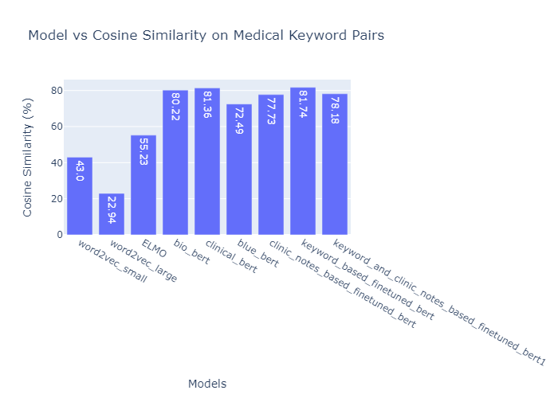

# Embedding Quality Evaluation for Health-related Data

This repository contains the analysis and evaluation of embedding quality for health-related data using various embedding models. The goal was to assess the effectiveness of different models in capturing the semantic meaning and context of health-related keywords and clinical notes.

# Directory Structure

- [Embedding Analysis1.ipynb](./Embedding%20Analysis1.ipynb): Notebook containing code with Seaborn graphs.
- [model_tuning.ipynb](./model_tuning.ipynb): Notebook containing model architectures and parameters for fine-tuning clinical BERT model.
- [preprocess_data.ipynb](./preprocess_data.ipynb): Notebook containing code for preprocessing ClinicNotes and Medical Keyword files.
- [report_on_embedding_analysis.pdf](./report_on_embedding_analysis.pdf): Detailed report on the embedding analysis study.
- [Embedding Analysis.ipynb](./Embedding%20Analysis.ipynb): Notebook containing same code as Embedding Analysis1.ipynb, but with Plotly graphs.

Feel free to explore the notebooks and report for more information.

## Evaluation Approaches

Two main approaches were used to assess the embedding quality:

1. Cosine Similarity between Medical Keyword Pairs: The cosine similarity was calculated for pairs of medical keywords to measure their similarity. A higher cosine similarity score indicates greater similarity between the keywords.

2. Scatter Plot of Clinic Notes Embeddings: The clinic notes were transformed into embeddings using different models, and the embeddings were visualized using scatter plots. The goal was to observe if similar categories of clinic notes formed distinct clusters in the plot.

## Embedding Models

Several embedding models were evaluated for their performance on health-related data:

1. Word2Vec: Word2Vec embeddings, obtained using pre-trained models like en_core_web_sm and en_core_web_lg from spaCy, were the initial baseline. However, they did not perform well in capturing health-related context.

2. ELMO: ELMO embeddings, which capture contextual information effectively, were used to generate embeddings for clinic notes. While ELMO performed better than Word2Vec, it was not specifically trained on health-related data.

3. BERT: BERT embeddings, including BERT base uncased, BioBERT, ClinicalBERT, and BlueBERT, were evaluated.  
   BERT Base uncased model excel at capturing context, but is not specifically trained on health-related data. BioBERT, ClinicalBERT, and BlueBERT are trained on health related data

4. Fine-tuned ClinicalBERT: ClinicalBERT was further fine-tuned using clinic notes data to improve its performance on health-related embeddings. This model was trained on a 3-class classification task to predict the category given clinic notes.

## Evaluation Results

The evaluation results revealed the following insights:

- Cosine similarity scores: The mean cosine similarity scores were calculated for each model's embeddings. The scores varied across models, with ClinicalBERT performing the best with a score of 0.81.

- Scatter plots: The scatter plots of clinic notes embeddings showed varying degrees of grouping. ClinicalBERT fine-tuned on clinic notes data exhibited the clearest groupings, indicating better capturing of health-related context.

- Keyword pair similarity: The models were also evaluated on the cosine similarity of medical keyword pairs. ClinicalBERT outperformed other models, achieving a similarity score of 0.8174.

## Conclusion

Based on the evaluation, ClinicalBERT, particularly when fine-tuned on clinic notes data, showed the best performance in capturing health-related context. However, there is room for further research and improvement, including hyperparameter tuning and the incorporation of more health-specific training data.

For a detailed analysis and code implementation, please refer to the Jupyter Notebook and the respective model directories in this repository.
All models performence on keyword pair cosine similarity task

